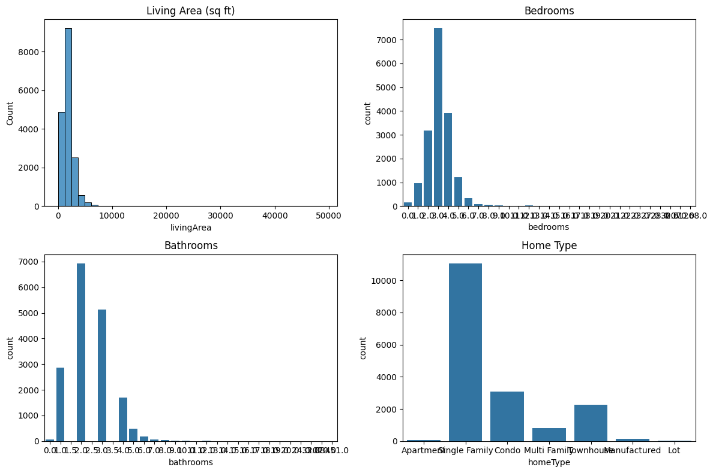
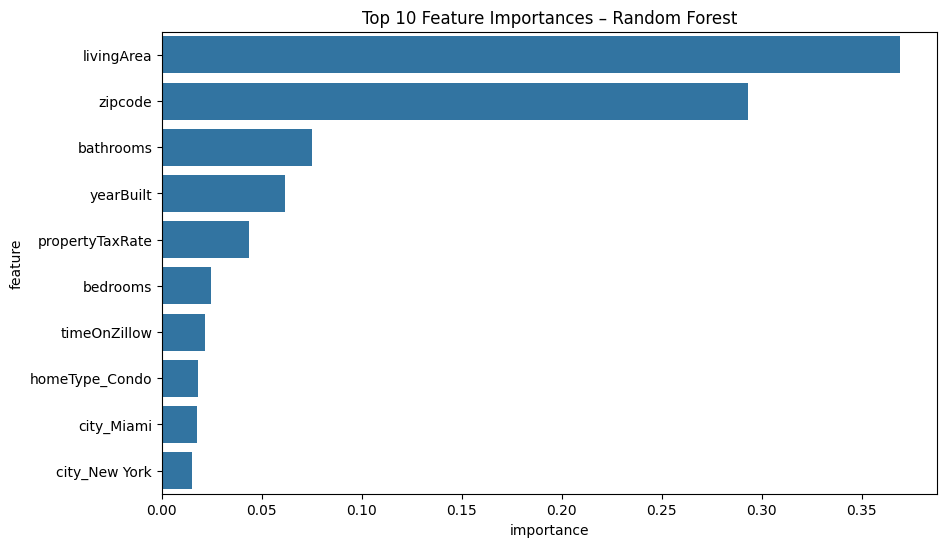

# Zillow Real Estate Price Prediction

## Overview
This project predicts residential real estate prices using statistical and machine learning models. The objective was to compare model interpretability and predictive performance.

## Methods
- Data cleaning & preprocessing
- Feature engineering
- One-hot encoding
- Train/test split

## Models
- OLS Regression (AIC stepwise selection)
- Random Forest Regressor
  
## Model Comparison

The Random Forest model outperformed Linear Regression in predictive accuracy, achieving a higher R² score on the test dataset.

## Random Forest Feature Importance

The feature importance analysis highlights the most influential variables driving housing price predictions, demonstrating the impact of property size and structural attributes.

## Results
Best performing model: Random Forest  
R² Score: [0.718]

## Tools
Python, pandas, scikit-learn, statsmodels, matplotlib

## Future Improvements
- Implement cross-validation
- Tune hyperparameters for Random Forest
- Incorporate external economic indicators
